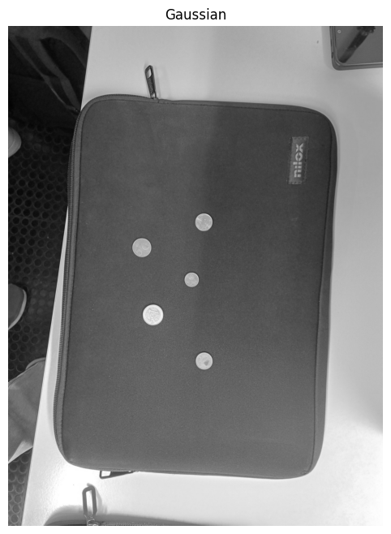
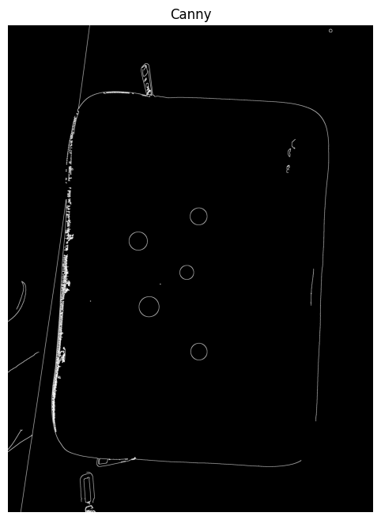
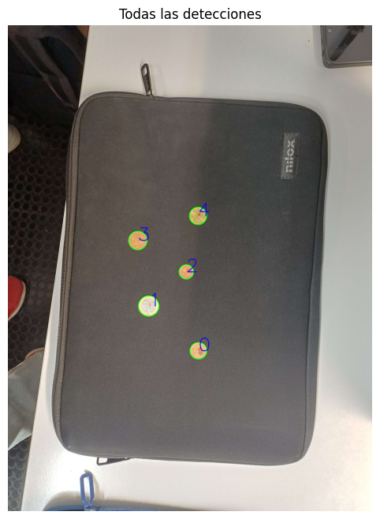
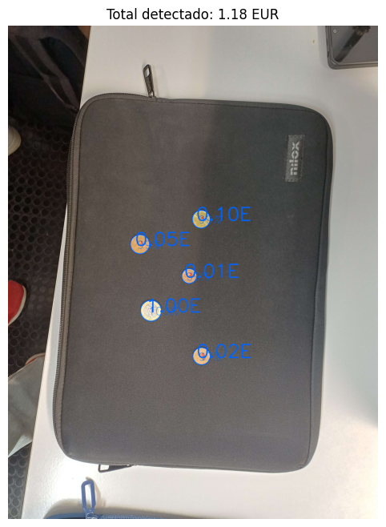
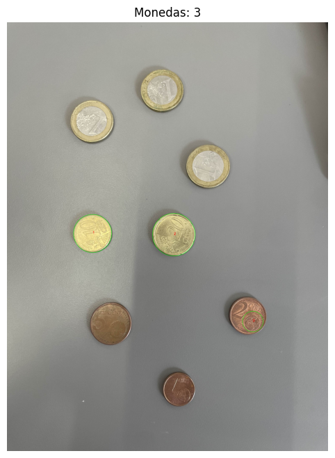
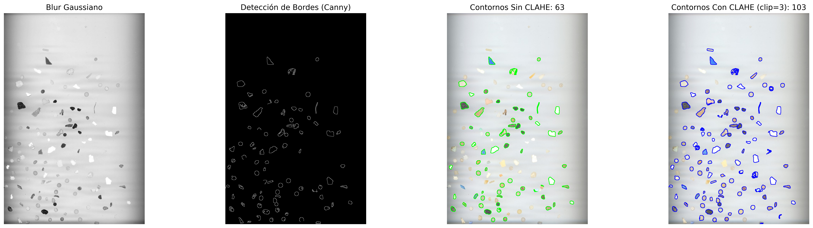
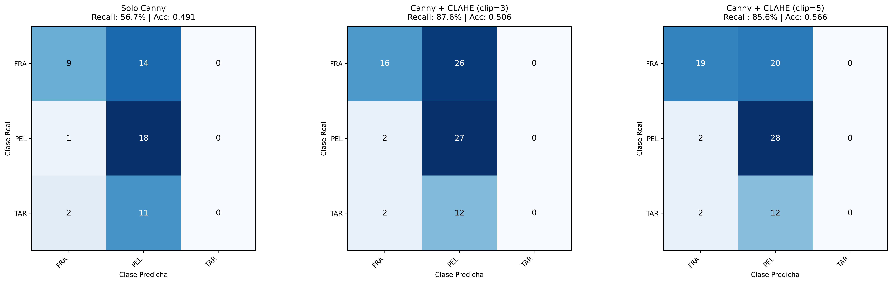
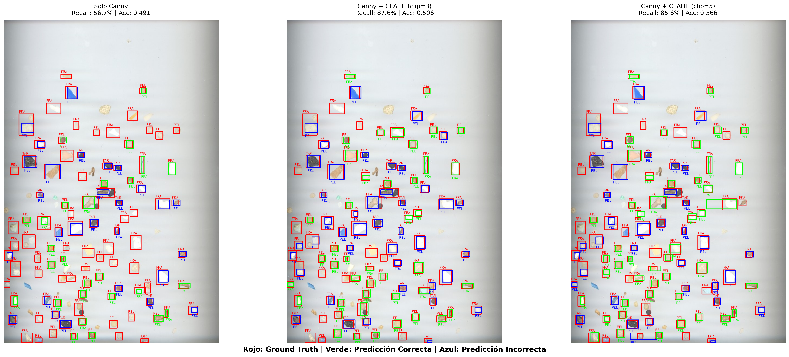

# Visión por computador - Práctica III
## Autores
 - Juan Carlos Rodríguez Ramírez
 - Mohamed O. Haroun Zarkik

## Introducción

## Entorno y librerías
Para el funcionamiento de esta práctica será necesario tener las librerías instaladas del proyecto base //TODO

## Tarea I
### Pasos realizados en el código Python

1. **Carga y preprocesamiento de la imagen**  
   Se carga la imagen de monedas y se convierte a escala de grises. Luego, se aplica un filtro Gaussiano para suavizar la imagen y reducir el ruido.

   ```python
   coins = cv2.imread("Monedas7.jpg")
   gray = cv2.cvtColor(coins, cv2.COLOR_BGR2GRAY)
   blur = cv2.GaussianBlur(gray, (7,7), 0)
   ```

   
   - Imagen suavizada: `Gaussian`

2. **Detección de bordes y contornos**  
   Se utiliza el detector de bordes de Canny para identificar los bordes en la imagen. Posteriormente, se encuentran los contornos y se filtran aquellos que no cumplen con criterios mínimos de área y circularidad.

   ```python
   canny = cv2.Canny(blur, 20, 255)
   contours, hierarchy = cv2.findContours(canny, cv2.RETR_EXTERNAL, cv2.CHAIN_APPROX_SIMPLE)
   ```

   
   - Imagen de bordes: `Canny`

3. **Filtrado y clasificación inicial de contornos**  
   Se calculan propiedades geométricas como el área y la circularidad para identificar contornos que correspondan a monedas. Los contornos válidos se dibujan en la imagen.

   ```python
   for cont in contours:
       area = cv2.contourArea(cont)
       if area > 800:
           perimeter = cv2.arcLength(cont, True)
           circularity = 4 * np.pi * area / (perimeter * perimeter)
           if circularity > 0.6:
               (x, y), radius = cv2.minEnclosingCircle(cont)
               monedas.append({'center': (int(x), int(y)), 'radius': int(radius)})
   ```

   **Nota importante:**  
   Existe un límite superior para el perímetro de los contornos que se consideran válidos. Este límite se establece para evitar que objetos demasiado grandes sean clasificados como monedas. En el código, se descartan contornos con un perímetro mayor a 800 píxeles, ya que en varias pruebas no hemos encontrado monedas superiores a ese tamaño, facilitando .

   ```python
   if perimeter < 800 and perimeter > 280:
       circularity = 4 * np.pi * area / (perimeter * perimeter)
   else:
       circularity = 0
   ```

   
   - Imagen con círculos dibujados alrededor de las monedas.

4. **Calibración con moneda de referencia**  
   Se solicita al usuario identificar una moneda de referencia (por ejemplo, de 1€) para calcular la relación entre píxeles y milímetros. Esto permite estimar el tamaño real de las monedas detectadas.

   ```python
   def calibrar_con_moneda_referencia(monedas, id_moneda, valor_euro):
       moneda_ref = monedas[id_moneda]
       diametro_px = moneda_ref['diameter_px']
       diametro_mm = diametros_mm[valor_euro]
       pixel_per_mm = diametro_px / diametro_mm
   ```

5. **Clasificación de monedas y cálculo del total**  
   Se clasifica cada moneda detectada comparando su diámetro estimado con los valores reales de las monedas en euros. Se calcula el total de dinero presente en la imagen.

   ```python
   for moneda in monedas:
       diametro_mm = moneda['diameter_px'] / pixel_per_mm
       for valor, diam_real in diametros_mm.items():
           error = abs(diametro_mm - diam_real) / diam_real
           if error < 0.10:
               total += valor
   ```

   
   - Imagen con valores y total detectado.

6. **Otras estrategias empleadas**
    Se han intentado otra estrategia para discriminar las diferentes monedas: *el uso del color*. La motivación de intentar este método es para tener una segunda fuente de información para aquellas monedas de tamaños relativamente similares como las monedas de 2 y 10 céntimos, y que presentan una diferencia de color notable. Sin embargo, las implementaciones usadas proporcionaban resultados o incluso peores a las usadas que emplean únicamente la dimensión y forma de la moneda.

7. **Importancia de la perspectiva**
    La imagen última y empleada en el código ha permitido obtener un resultado totalmente correcto. Es debido a que se realiza verticalmente a una cierta distancia. La foto realizada de esta forma proporciona un doble beneficio. Primero, la mayor distancia ofrece una menor resolución, aunque pueda parecer contraintuitivo, ello permite que no se procese los detalles interiores que podrían confundir el procesamiento de la imagen.

    Por ejemplo, en la siguiente imagen se comprueba que el globo dibujado en la moneda de 2 céntimos confunde el algoritmo.

    
   - Detección de detalles innecesarios y confusos.

   En segundo lugar, la mayor distancia y el ángulo perpendicular sobre el plano en donde descansan las monedas reducen la distorsión de la perspectiva. Reducir esta distorsión es imperativo al ser el algoritmo visto previamente depende que las proporciones de las monedas sean adecuadas, especialmente de la moneda de 1 euro empleada como referencia para el resto.

    
   - Imagen con problemas por la perspectiva.

## Tarea II - Clasificación de microplásticos mediante características geométricas

Esta tarea aborda la detección y clasificación automática de microplásticos en imágenes con fondos blancos, utilizando técnicas de visión por computador. El objetivo principal es extraer características geométricas de las partículas detectadas y clasificarlas en tres categorías: **FRA** (Fragmentos), **PEL** (Pellets) y **TAR** (Alquitrán). La metodología implementada se basa en el trabajo de [SMACC: A System for Microplastics Automatic Counting and Classification](https://doi.org/10.1109/ACCESS.2020.2970498), que utiliza características geométricas para la clasificación de microplásticos.

### Proceso Iterativo de Desarrollo
El desarrollo del sistema de detección siguió un proceso iterativo de prueba y error, explorando diferentes técnicas de procesamiento de imagen:

#### Fase 1: Detección con Canny
Inicialmente se implementó un detector de bordes basado en el algoritmo de Canny con parámetros estándar (`threshold1=50`, `threshold2=150`). Los resultados iniciales mostraron un recall del 46%, lo cual indicaba un margen considerable de mejora. Muchas partículas pequeñas o con bajo contraste no estaban siendo detectadas.

#### Fase 2: Experimentación con Sobel
Se exploró el uso del operador de Sobel como alternativa a Canny, con la hipótesis de que podría capturar mejor ciertos tipos de bordes. Sin embargo, los resultados no mejoraron significativamente. Se intentó combinar Sobel con operaciones morfológicas como `cv2.dilate()` para cerrar contornos fragmentados y formar círculos completos, pero esta aproximación no logró resultados satisfactorios debido a la naturaleza irregular de las partículas de microplásticos.

#### Fase 3: Optimización del Emparejamiento con IoU
Retomando Canny, se aplicaron operaciones morfológicas de cierre (cv2.MORPH_CLOSE) para conectar bordes fragmentados. Sin embargo, esta idea se terminó abandonando, y el avance más significativo provino de mejorar la métrica de emparejamiento entre contornos detectados y anotaciones.

El método inicial basado en distancia euclidiana entre centroides presentaba limitaciones: contornos correctamente posicionados podían fallar por desplazamientos mínimos, mientras que la coincidencia espacial no garantizaba overlap real de áreas. Se implementó IoU (Intersection over Union) como métrica de emparejamiento, definida como el cociente entre el área de intersección y el área de unión de dos bounding boxes. Un contorno se considera correctamente emparejado si IoU > 0.2. Este cambio metodológico incrementó el recall del 46% al 56%.

No obstante, el 44% de partículas sin detectar indicaba que el problema principal no era la fragmentación de bordes ni el método de emparejamiento, sino que muchos bordes no generaban suficiente gradiente de intensidad para ser detectados por Canny. Esto motivó la exploración de técnicas de mejora de contraste.

#### Fase 4: CLAHE - Mejora de Contraste Adaptativa
Tras mucho pensar, el análisis de las imágenes reveló que uno de los principales problemas podría, y era, la calidad y contraste heterogéneo de la imagen. Las zonas con iluminación irregular impedían que muchas partículas generaran gradientes de intensidad suficientes para ser detectadas por Canny.

Explorando técnicas de mejora de imagen en [GeeksforGeeks - CLAHE Histogram Equalization](https://www.geeksforgeeks.org/python/clahe-histogram-eqalization-opencv/), se descubrió **CLAHE (Contrast Limited Adaptive Histogram Equalization)**, una técnica de ecualización de histograma adaptativa que mejora el contraste localmente.

La implementación de CLAHE con `clipLimit=3.0` y `tileGridSize=(8,8)` produjo una mejora importante, alcanzando un **recall del 87%**. Este incremento del 31% respecto a la fase anterior confirmó que el preprocesamiento de contraste era crítico para la detección efectiva de microplásticos. No obstante, debemos entender qué hace que CLAHE sea tan crucial.

#### ¿Qué es CLAHE?
CLAHE es una técnica de mejora de contraste que opera de forma **adaptativa** en regiones locales de la imagen, a diferencia de la ecualización de histograma tradicional que opera globalmente. Esta característica la hace especialmente efectiva para imágenes con iluminación no uniforme.

#### Parámetros Clave
- **clipLimit**: Limita la amplificación del contraste para evitar sobreenfatizar el ruido. Un valor de 3.0 proporciona un balance óptimo entre mejora de contraste y supresión de ruido.
- **tileGridSize**: Define el tamaño de las regiones locales (8×8 píxeles en nuestro caso), permitiendo que cada zona sea ecualizada independientemente.

CLAHE resuelve varios problemas fundamentales en la detección de microplásticos:

- Normalización de contraste local: Las partículas ubicadas en zonas oscuras de la imagen originalmente tenían gradientes de intensidad muy débiles (diferencias de solo 5-10 niveles de gris con el fondo). CLAHE amplifica estos gradientes localmente, convirtiendo bordes imperceptibles en bordes detectables por Canny.
- Independencia de la iluminación global: Sin CLAHE, partículas en zonas brillantes quedaban "lavadas" por sobreexposición, mientras que partículas en zonas oscuras se perdían en las sombras. CLAHE trata cada región de 8×8 píxeles independientemente, normalizando el rango de intensidades en toda la imagen.
- Preservación de estructuras: A diferencia de otros métodos de mejora más agresivos, el parámetro `clipLimit` asegura que las estructuras reales (bordes de partículas) se amplifiquen más que el ruido aleatorio, manteniendo la integridad morfológica de los microplásticos.

El siguiente diagrama muestra el pipeline de procesamiento completo:



#### Extracción de Características Geométricas

Siguiendo la metodología del sistema SMACC, se extraen las siguientes características geométricas de cada contorno detectado:

1. **Área**: Número de píxeles dentro del contorno
2. **Perímetro**: Longitud del contorno en píxeles
3. **Compacidad**: Relación P²/A, mide cuán irregular es la forma
4. **Extent**: Relación entre el área del contorno y su bounding box
5. **Aspect Ratio**: Relación ancho/alto del bounding box
6. **Solidity**: Relación entre el área del contorno y su convex hull
7. **Relación de distancias al centroide**: Radio mínimo/máximo desde el centroide

#### Clasificación Heurística

Dado el tamaño limitado del conjunto de datos, se implementó un clasificador basado en reglas heurísticas derivadas del análisis de las características geométricas:

- **PEL (Pellets)**: Formas compactas y regulares con `0.7 ≤ aspect_ratio ≤ 1.3`, `extent > 0.7` y `solidity > 0.85`
- **FRA (Fragmentos)**: Formas irregulares angulares con `solidity < 0.85` y `compactness > 15`
- **TAR (Alquitrán)**: Formas muy irregulares y amorfas con `solidity < 0.75`

#### Emparejamiento con Ground Truth

Para evaluar el rendimiento del sistema, se utiliza **IoU (Intersection over Union)** entre los bounding boxes detectados y las anotaciones del ground truth. Un contorno se considera emparejado correctamente si `IoU > 0.2`.

### Resultados Experimentales

#### Comparación de Configuraciones

Se evaluaron tres configuraciones de preprocesamiento:

1. **Solo Canny**: Detección de bordes sin mejora de contraste
2. **Canny + CLAHE (clipLimit=3)**: Configuración óptima encontrada
3. **Canny + CLAHE (clipLimit=5)**: Prueba con amplificación más agresiva



**Tabla 1: Comparación cuantitativa de resultados**
```
================================================================================
Método                         Contornos    Recall       Accuracy    
--------------------------------------------------------------------------------
Solo Canny                     63           56.70       % 0.491       
Canny + CLAHE (clip=3)         103          87.63       % 0.506       
Canny + CLAHE (clip=5)         101          85.57       % 0.566    
================================================================================
```

#### Análisis Visual de Detecciones



**Observaciones clave**:

- **CLAHE mejora significativamente el recall**: La configuración con `clipLimit=3` detecta considerablemente más partículas que el método baseline, especialmente en zonas de bajo contraste.

- **Riesgo de dobles detecciones**: Con valores altos de `clipLimit` (5), se observan ocasionalmente **dobles detecciones** de la misma partícula, donde el aumento excesivo de contraste genera múltiples bordes para una única partícula real.

- **Balance entre recall y precisión**: `clipLimit=3` proporciona el mejor balance, maximizando las detecciones verdaderas mientras minimiza falsos positivos y dobles contornos.

### Conclusiones

Este proyecto demuestra que el **preprocesamiento de imagen es tan crítico como el algoritmo de detección** en aplicaciones de visión por computador. La implementación de CLAHE incrementó el recall en un 31% (de 56% a 87%), confirmando que la normalización de contraste local es esencial para detectar microplásticos en imágenes con iluminación heterogénea.

## Referencias

- Caballero, D., Calvini, R., & Amigo, J. M. (2020). SMACC: A System for Microplastics Automatic Counting and Classification. *IEEE Access*, 8, 25249-25261. [https://doi.org/10.1109/ACCESS.2020.2970498](https://doi.org/10.1109/ACCESS.2020.2970498)

- GeeksforGeeks. (2020). CLAHE Histogram Equalization - OpenCV. [https://www.geeksforgeeks.org/python/clahe-histogram-eqalization-opencv/](https://www.geeksforgeeks.org/python/clahe-histogram-eqalization-opencv/)

## Uso de IA
Para la tarea 1, se empleo Claude Sonnet 4.5 para la realización o propuesta base de los diferentes *Code Cells*, especialmente en relación en aquellos de cómo calcular el contorno. También se empleó para adaptar la estrategia para que tenga en cuenta el color, pero con resultados deficientes.

Para la tarea 2, también se hizo uso de Claude Sonnet 4.5 para separar en distintos métodos los procedimientos de calcular el IoU, extraer características, clasificar y procesar para poder ejecutarlos de manera ordenada y limpia. 

Además, de forma general, fue de gran utilidad para la presentación de los datos en un mismo *output*, y para una mejor redacción del READme.
